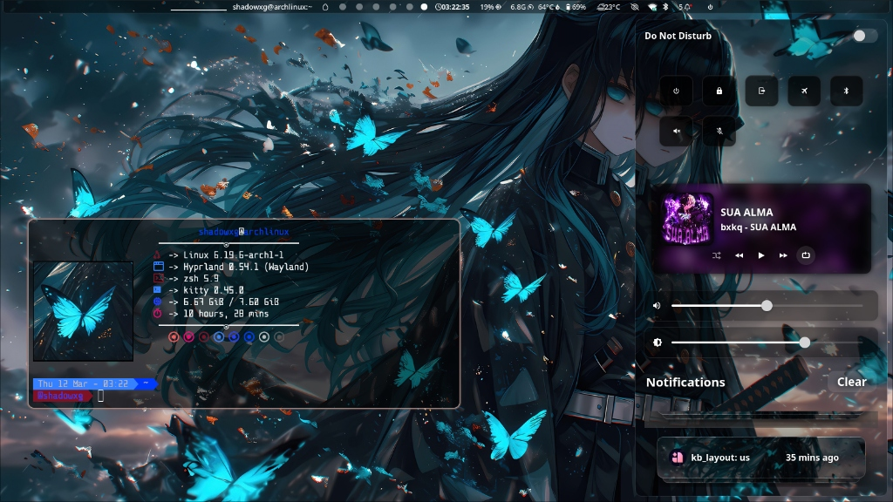
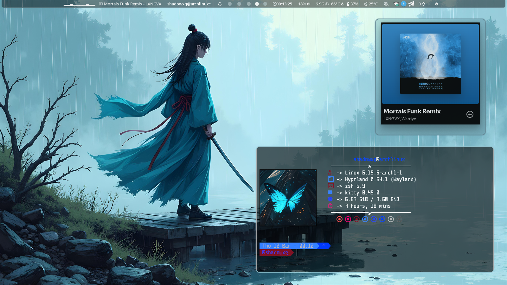
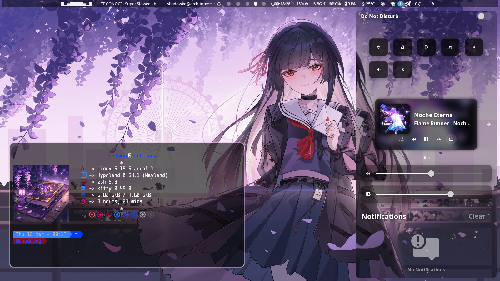
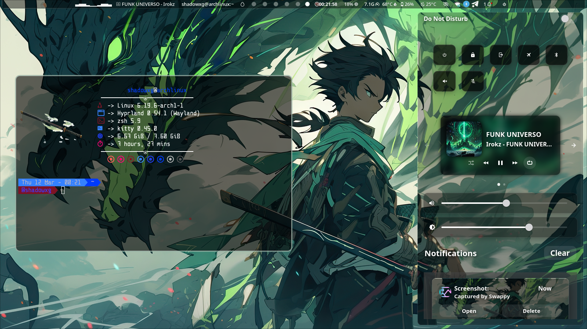
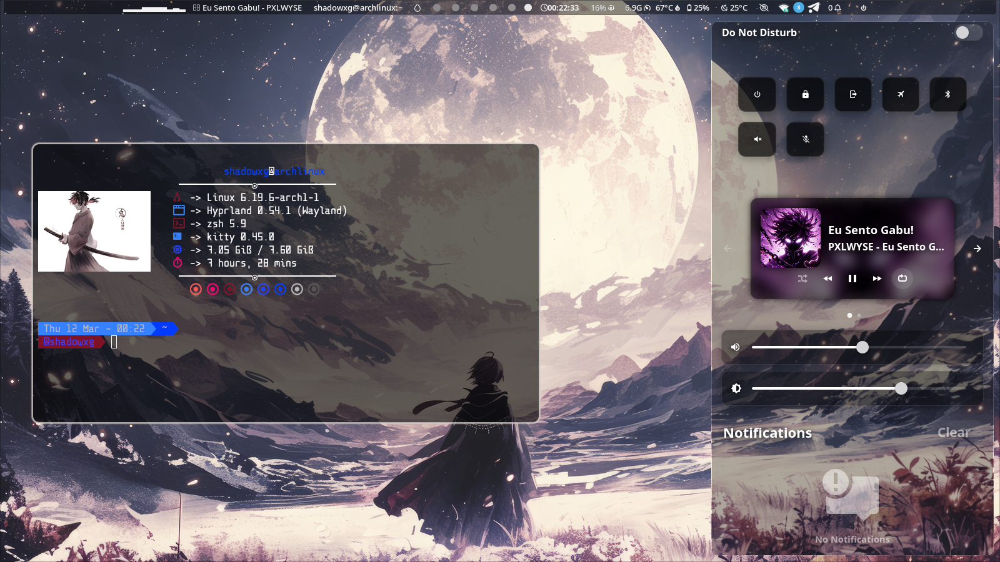
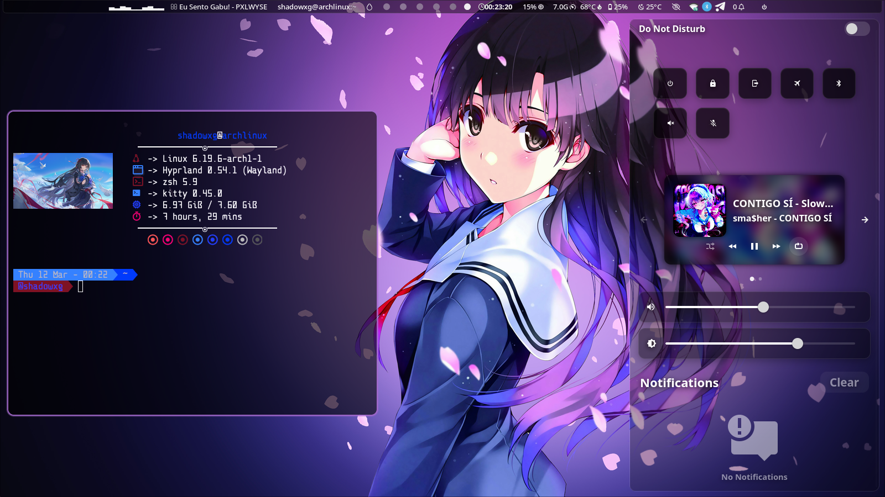

# 🪟 ShadowXG Hyprland Glass Rice (v3.2)

A premium, highly-customizable, and "glassy" Hyprland rice featuring a library of **45 unique themes**. Includes one-click setup, graphical theme selection, and automated backup/restore functionality.


## 🚀 One-Click Installation

Clone the repository and run the setup script. The installer handles dependencies, configures your system, and creates backups of your existing setups.

```bash
git clone https://github.com/MangalNathYadav/ShadowXG_Hyprland_Glassy.git
cd ShadowXG_Hyprland_Glassy/shadowxg_rice
bash one-click-setup.sh
```

### What's Included:
- **Core Components**: Pre-configured Waybar, SwayNC, Kitty, and Fastfetch.
- **Glassy Aesthetics**: Custom Hyprland rules for blur, transparency, and rounded corners.
- **Dependency Management**: Integrated AUR support for `mpvpaper` (Live Wallpapers).
- **Auto-Backup**: Your original configs are safely stored in `~/.config/shadowxg_rice_backup`.

## 🎨 Themes Gallery

Experience the premium glassy aesthetic with our curated themes. Each screenshot shows the full system integration, including Waybar, Fastfetch, and Wallust color syncing.

| **Gojo Theme** | **Jinhsi Theme** |
| :---: | :---: |
|  |  |
| **Samurai Red** | **Dark Glass** |
|  |  |
| **Anime Vibe** | **Stealth Mode** |
|  |  |

> [!TIP]
> Use `SUPER+T` to switch between these themes instantly!

## 🎨 Theme Management

### Theme Selector (`SUPER + T`)
Change the look and feel of your desktop instantly with a graphical picker!
- **Internal Themes**: Choose from high-quality, curated themes (Gojo, Glassy-Dark, etc.).
- **Wallust Integration**: Colors across all apps (Waybar, Kitty, Rofi) sync automatically with your wallpaper.

### 🧩 Custom Theme Guide
Register your own wallpapers and themes without touching the repository code! This is perfect for personalizing your setup while keeping the core rice updatable.

#### 1. Prepare your Theme Folder
Create a folder anywhere (e.g., `~/Pictures/MyCustomRice`) and add these files:
- `wallpaper.jpg` or `wallpaper.png`: **(Required)** This sets your desktop background and generates the `wallust` color scheme.
- `terminal.png`: *(Optional)* Sets the image logo for your terminal and Fastfetch. If missing, the wallpaper is used.
- `wallpaper.mp4`: *(Optional)* Provides a Live Wallpaper effect (requires `mpvpaper`).

#### 2. Register the Theme
Simply add the absolute path of your folder to the registration file:
```bash
echo "$HOME/Pictures/MyCustomRice" >> ~/.config/shadowxg_rice/external_themes.txt
```

#### 3. Switch and Enjoy
Press `SUPER+T` and your custom theme will appear in the selection menu with a preview!

---

## 🛠️ Restoration & Uninstallation

We value your existing setup. If you ever want to revert, run:

```bash
bash ~/uninstall_rice.sh
```

This will:
- Restore your original configs from the backup.
- Remove all rice management scripts and files.
- Revert the `SUPER+T` keybinding.

## 📦 Requirements
- **OS**: Arch Linux (Recommended)
- **AUR Helper**: `yay` or `paru` (for `mpvpaper`)
- **Core Tools**: `hyprland`, `waybar`, `swaync`, `rofi-wayland`, `fastfetch`, `wallust`, `kitty`, `swww`.

## 🤝 Contributing
Feel free to open issues or submit PRs to improve the rice or add new themes!
